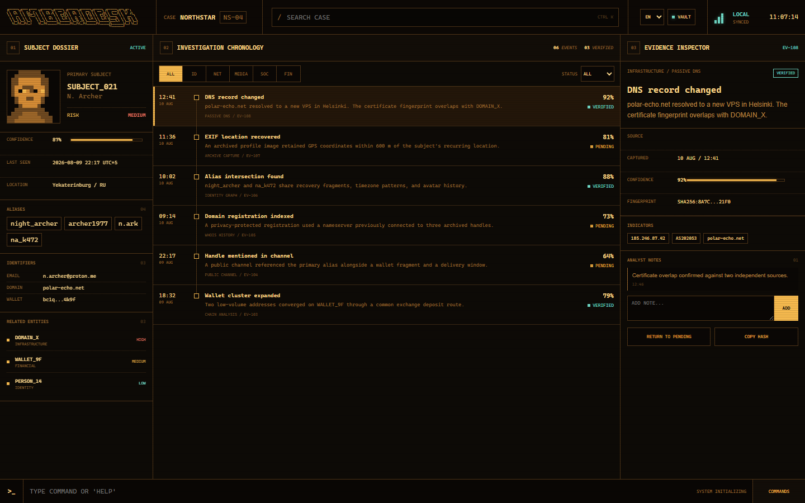
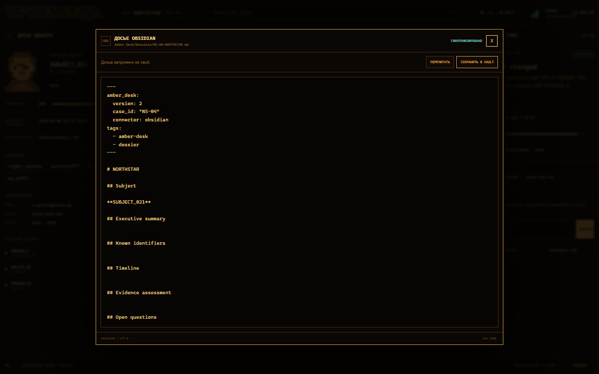
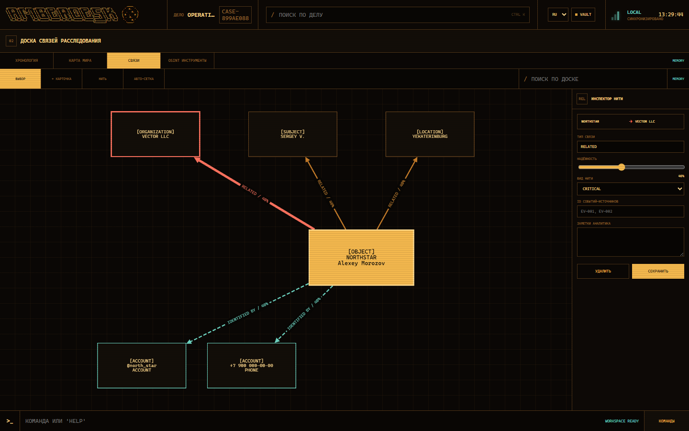
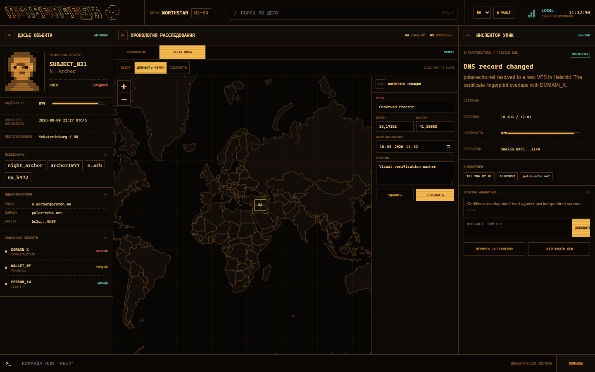
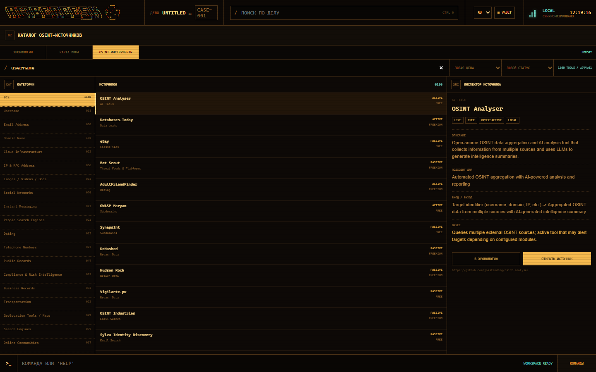

```text
 ________  _____ ______   ________  _______   ________  ________  _______   ________  ___  __
|\   __  \|\   _ \  _   \|\   __  \|\  ___ \ |\   __  \|\   ___ \|\  ___ \ |\   ____\|\  \|\  \
\ \  \|\  \ \  \\\__\ \  \ \  \|\ /\ \   __/|\ \  \|\  \ \  \_|\ \ \   __/|\ \  \___|\ \  \/  /|_
 \ \   __  \ \  \\|__| \  \ \   __  \ \  \_|/_\ \   _  _\ \  \ \\ \ \  \_|/_\ \_____  \ \   ___  \
  \ \  \ \  \ \  \    \ \  \ \  \|\  \ \  \_|\ \ \  \\  \\ \  \_\\ \ \  \_|\ \|____|\  \ \  \\ \  \
   \ \__\ \__\ \__\    \ \__\ \_______\ \_______\ \__\\ _\\ \_______\ \_______\____\_\  \ \__\\ \__\
    \|__|\|__|\|__|     \|__|\|_______|\|_______|\|__|\|__|\|_______|\|_______|\_________\|__| \|__|
                                                                              \|_________|
```

# Amber Desk

Extensible browser workspace for OSINT investigations. Amber Desk combines a dense dossier timeline, evidence review, command workflow, and backend connectors in a pixel-inspired amber CRT interface.



## Features

- Dossier, Obsidian-backed chronology, evidence, world map, and OSINT source workspaces
- English and Russian interface localization
- Search and evidence filters
- Verification status and analyst notes
- Keyboard command palette
- Responsive desktop and mobile layouts
- Go backend with embedded frontend assets
- Connector registry for external tools
- Bidirectional Obsidian Markdown dossier synchronization
- Interactive local world map with draggable markers and movement routes
- Offline local XYZ map packs for street, building, address, and POI detail
- Timeline, marker, and route notes persisted as readable Markdown
- Conflict protection when an Obsidian file changes externally
- Local OSINT Framework catalog with category, text, pricing, and status filters
- One-click source provenance logging into the investigation chronology
- Three-step dossier creation wizard with local-first Obsidian synchronization
- Per-dossier investigation route with 8 phases, 43 editable steps, and a recommended next action
- Detective-style relationship board with draggable clue cards and sourced threads
- Local relationship-card attachments with hashes, downloads, and at-a-glance document stacks
- Local photo covers for relationship cards with automatic first-image selection
- A dossier profile photo shared with the primary relationship card and stored through the same local provider
- Native Sherlock username scans with manual relationship import
- Multi-dossier picker with Obsidian-backed switching and restart recovery
- Vault-local trash for complete cases and individual chronology records

## Quick Start

Requirements: Go 1.22 or newer.

```powershell
git clone https://github.com/doctorFrankinshtane/amber_desk.git
cd amber_desk
go run .
```

Open <http://localhost:8080>.

## Obsidian

Amber Desk accesses an existing Obsidian vault through the local filesystem. It does not require an Obsidian plugin.

```powershell
$env:OBSIDIAN_VAULT = "C:\Users\you\Documents\My Vault"
$env:OBSIDIAN_DOSSIER_DIR = "Amber Desk\Dossiers"
go run .
```

Open **Vault** in the application header to create or edit the current case dossier. The generated file contains YAML frontmatter and standard Markdown. Changes made in Obsidian can be reloaded; stale saves return a conflict instead of overwriting external edits.

When the vault is connected, the chronology and map use Obsidian as their canonical backend. Amber Desk stores one note per entity:

```text
Amber Desk/
  Dossiers/
  Cases/<case-id>/
    Checklist.md
    Timeline/<event-id>.md
    Map/Markers/<marker-id>.md
    Map/Routes/<route-id>.md
    Relations/Nodes/<node-id>.md
    Relations/Edges/<edge-id>.md
    Relations/Attachments/<node-id>/<attachment-id>/
      metadata.json
      content.bin
  .state/
    cases-index.json
    active-case-id.json
    cases/<case-id>.json
  .trash/<case-id>-<timestamp>/
```

Legacy `<case-id>-<case-name>` paths are discovered by case-ID prefix and remain readable. New cases use stable ID-only paths, so renaming a display title does not move investigation data.

Each note has versioned YAML frontmatter for Amber Desk and a readable Markdown body for editing and linking inside Obsidian. New workspaces start with an empty case and chronology. Changes in either application are picked up by the browser automatically or on reload.



## Dossier Creation

The case block in the header opens the dossier picker. It can search, switch, or create another dossier without discarding existing investigations. The three-step wizard captures the case, primary subject, identifiers, and initial related entities. When Obsidian is connected, Amber Desk creates the dossier, case snapshot, index entry, and relationship notes in the vault during the same request.

Deleting a dossier requires typing its exact case ID. Amber Desk moves the dossier, chronology, map, relationships, and case snapshot to the vault-local `.trash` directory. Timeline records use the same local-trash model and require a separate confirmation.

## Investigation Route

The dossier panel includes a beginner-friendly route covering scope, seed data, search planning, collection, preservation, verification, relationships, chronology, geography, analysis, and reporting. Amber Desk recommends the first pending step but never locks phases or workspaces. Investigators can complete, reopen, skip, edit, or pin any step and add their own tasks to any phase.

Checklist state belongs to the active case. Obsidian stores it as a readable `Checklist.md`; providers implementing `ChecklistConnector` can supply the same `checklist.read` and `checklist.write` capabilities. Without a connected provider, Amber Desk uses a case-keyed memory fallback. Step actions only open the relevant local workspace and never launch an external query automatically.

## Relationship Board

Open **Relations** to arrange the investigation as a detective link board. The primary object stays visually distinct while subjects, organizations, accounts, locations, infrastructure, evidence, and facts appear as draggable clue cards. Directional threads store a label, confidence, kind, source event IDs, and an analyst note. Amber, red, and teal threads represent standard, critical, and evidence-backed relationships.

The graph engine is bundled locally. Card positions and threads are stored through the relationship capability provider, using readable Markdown notes when Obsidian is connected. Each card can hold up to 20 local files of 10 MiB each. Amber Desk validates filenames, computes a SHA-256 digest, keeps file bytes inside the active case directory, and shows the attachment count as a document stack without opening the inspector. The first JPEG, PNG, WebP, or GIF becomes the card cover automatically; another attached image can be promoted from the inspector. Cover images are served only by the local Amber Desk backend and the selected attachment ID is persisted in Obsidian frontmatter. Removed files are moved into the case-local `.trash` tree.

The photo in the dossier identity block is the cover of the primary relationship card. Uploading it from either view updates the same attachment and cover metadata, so there is no duplicate image state outside the local case provider.



### Sherlock

Sherlock is an optional local process integration inside the selected relationship card; it does not add another workspace tab. Install the pinned runtime once:

```powershell
.\tools\sherlock\setup.ps1
```

On Linux or macOS use `./tools/sherlock/setup.sh`. Amber Desk detects `.tools/sherlock` automatically, or `SHERLOCK_PYTHON` can point to another absolute Python executable containing the supported version.

Choose **Sherlock / Scan** in a subject or account card, or enter `SHERLOCK <username>` in the command bar. Every run requires confirmation because Sherlock sends the entered username to supported third-party sites. Dossier notes, graph data, and attachments remain local. Results are candidates, not verified identities: select claimed profiles manually before import. Amber Desk then creates low-confidence account nodes and `FOUND ON` threads, writes one pending timeline event, and attaches the complete JSON report to the source card. With Obsidian connected, all imported records use the existing vault layout.

## Investigation Map

Open **World Map** above the chronology. Use **Add Marker** and click the map to record a location. Markers can be selected, edited, or dragged. Use **Connect**, then select two markers to create a movement route.

The map makes no runtime requests to external map services. The bundled Natural Earth dataset provides a worldwide overview with cities, urban areas, regions, major roads, rivers, and lakes. For street-level buildings, addresses, cafes, restaurants, and other POIs, configure a locally stored raster XYZ pack:

```text
D:\Maps\amber-xyz\
  0\0\0.png
  1\0\0.png
  1\0\1.png
  ...
```

Set `MAP_TILE_DIR` to the pack root. Labels and POIs must be rendered into the local tiles by the pack producer. Amber Desk serves only the tiles needed for the visible viewport through its own Go backend; the browser communicates exclusively with `localhost`.



## OSINT Source Catalog

Open **OSINT Tools** above the chronology to browse the bundled OSINT Framework snapshot. The catalog is normalized and validated by a separate Go `CatalogProvider`; it is not stored in Obsidian and the browser does not fetch catalog data from third-party servers.

Search and filters run locally. **Open Source** is the only action that leaves Amber Desk, and it opens the selected third-party URL with referrer suppression. **Log to Timeline** records the tool name, URL, catalog version, and selection time through the same timeline backend used by manual events.

The bundled snapshot comes from OSINT Framework commit `a744e613d7ded0aaa854896feb2a1069de34d2f8`. See [OSINT Framework Integration](docs/OSINT_FRAMEWORK.md) and [Third-Party Notices](docs/THIRD_PARTY.md) for provenance and licensing.



## Configuration

| Variable | Default | Purpose |
| --- | --- | --- |
| `ADDR` | `:8080` | HTTP listen address |
| `OBSIDIAN_VAULT` | unset | Absolute path to an existing Obsidian vault |
| `OBSIDIAN_DOSSIER_DIR` | `Amber Desk/Dossiers` | Relative dossier directory inside the vault |
| `MAP_TILE_DIR` | unset | Absolute path to a local raster XYZ map pack |
| `MAP_TILE_EXT` | `png` | Tile file extension: `png`, `jpg`, `jpeg`, or `webp` |
| `MAP_TILE_MIN_ZOOM` | `0` | Lowest zoom available in the local pack |
| `MAP_TILE_MAX_ZOOM` | `18` | Highest zoom available in the local pack |
| `SHERLOCK_PYTHON` | project-local `.tools/sherlock` | Absolute path to the supported Sherlock Python runtime |
| `ALLOW_REMOTE_TOOL_RUNS` | `0` | Permit process-backed tools when Amber Desk is accessed beyond localhost |

See [.env.example](.env.example) for a local template.

## API

- `GET /api/health`
- `GET /api/case`
- `POST /api/case`
- `GET /api/cases`
- `PUT /api/cases/active`
- `DELETE /api/cases/{id}`
- `GET /api/timeline`
- `POST /api/timeline/events`
- `PATCH /api/events/{id}/status`
- `POST /api/events/{id}/notes`
- `DELETE /api/events/{id}`
- `GET /api/tools/sherlock/status`
- `POST /api/tools/sherlock/scans`
- `GET /api/tools/sherlock/scans/{id}`
- `GET /api/tools/sherlock/scans/{id}/events`
- `DELETE /api/tools/sherlock/scans/{id}`
- `POST /api/tools/sherlock/scans/{id}/import`
- `GET /api/map`
- `POST /api/map/markers`
- `PUT /api/map/markers/{id}`
- `DELETE /api/map/markers/{id}`
- `POST /api/map/routes`
- `DELETE /api/map/routes/{id}`
- `GET /api/catalog`
- `GET /api/checklist`
- `POST /api/checklist/tasks`
- `PUT /api/checklist/tasks/{id}`
- `DELETE /api/checklist/tasks/{id}`
- `POST /api/checklist/reset`
- `GET /api/relationships`
- `POST /api/relationships/nodes`
- `PUT /api/relationships/nodes/{id}`
- `DELETE /api/relationships/nodes/{id}`
- `PUT /api/relationships/nodes/{id}/cover`
- `GET /api/relationships/nodes/{id}/attachments`
- `POST /api/relationships/nodes/{id}/attachments`
- `GET /api/relationships/nodes/{id}/attachments/{attachmentId}`
- `DELETE /api/relationships/nodes/{id}/attachments/{attachmentId}`
- `POST /api/relationships/edges`
- `PUT /api/relationships/edges/{id}`
- `DELETE /api/relationships/edges/{id}`
- `GET /api/integrations`
- `GET /api/integrations/{id}/dossier`
- `PUT /api/integrations/{id}/dossier`

The initial case and chronology are empty when no persisted active case exists. Providers may advertise `cases.*`, `timeline.*`, `map.*`, or other optional capability families. Unsupported data families use a session-only memory fallback.

## Extensions

Integrations implement a small Go connector interface and register with the backend registry. The frontend discovers connector metadata and health through the API rather than importing integration-specific code into the case model.

Read [Connector Development](docs/CONNECTORS.md) before adding an integration. Contribution conventions are in [CONTRIBUTING.md](CONTRIBUTING.md).

## Development

```powershell
go test ./...
go vet ./...
go build .
```

Do not commit vault contents, API keys, investigation exports, or real subject data. See [SECURITY.md](SECURITY.md).

Third-party asset and library notices are documented in [Third-Party Notices](docs/THIRD_PARTY.md).
